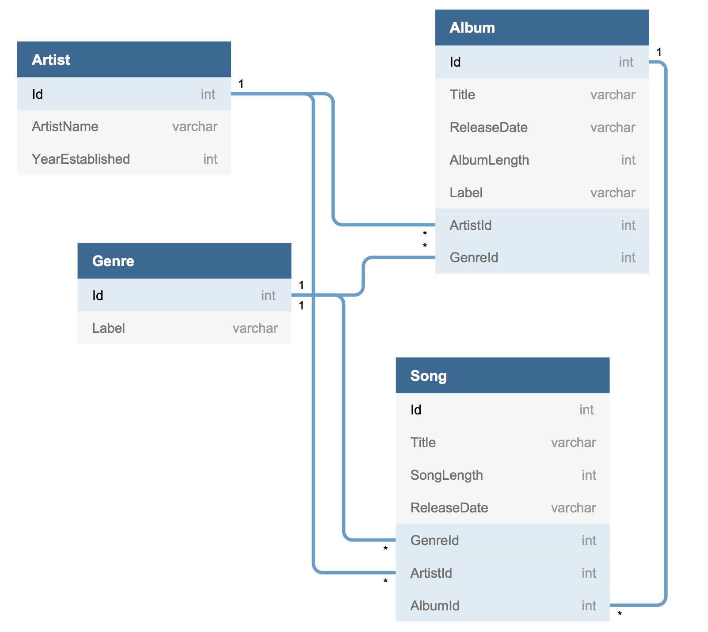

## SQL Practice

https://github.com/nashville-software-school/bangazon-inc/blob/master/book-1-orientation/chapters/SQL_INTRO.md

### Instructions
1. Using the Object Explorer in SSMS, examine the tables, columns, and foreign keys of the database.
2. Using the dbdiagram.io site, create an ERD for the database.

<a href="sql_musicHistory/musichistory.sqlserver.sql" target="_blank">Database</a>

For each of the following exercises, provide the appropriate query. 



1. Query all of the entries in the `Genre` table
```sql
SELECT * FROM Genre;
```

2. Using the `INSERT` statement, add one of your favorite artists to the `Artist` table.
```sql
INSERT INTO Artist (ArtistName, YearEstablished) 
VALUES ('The Talking Heads', 1975);
```

3. Using the `INSERT` statement, add one, or more, albums by your artist to the `Album` table.
```sql
INSERT INTO Album (Title, ReleaseDate, AlbumLength, Label, ArtistId, GenreId)
VALUES ('Fear of Music', '08/03/1979', 41, 'Sire', 29, 2)
```

4. Using the `INSERT` statement, add some songs that are on that album to the `Song` table.
```sql
INSERT INTO Song (Title, SongLength, ReleaseDate, GenreId, ArtistId, AlbumId)
VALUES ('Life During Wartime', 221, '08/03/1979', 2, 29, 23)
INSERT INTO Song (Title, SongLength, ReleaseDate, GenreId, ArtistId, AlbumId)
VALUES ('Heaven', 241, '08/03/1979', 2, 29, 23)
```

5. Write a `SELECT` query that provides the song titles, album title, and artist name for all of the data you just entered in. Use the LEFT JOIN keyword sequence to connect the tables, and the WHERE keyword to filter the results to the album and artist you added.
```sql
SELECT s.Title, a.Title, ar.ArtistName
FROM Song s 
LEFT JOIN Album a 
ON s.AlbumId = a.Id
LEFT JOIN Artist ar
ON a.ArtistId = ar.Id
WHERE s.ArtistId = 29;
```

6. Write a `SELECT` statement to display how many songs exist for each album. You'll need to use the `COUNT()` function and the `GROUP BY` keyword sequence.
```sql
SELECT Album.Title, COUNT(Song.Id) AS NumberOfSongs FROM Song
LEFT JOIN Album ON Song.AlbumId = Album.Id
GROUP BY Album.Title;
```

7. Write a `SELECT` statement to display how many songs exist for each artist. You'll need to use the `COUNT()` function and the `GROUP BY` keyword sequence.
```sql
SELECT Artist.ArtistName, COUNT(Song.Id) AS NumberOfSongs FROM Song
LEFT JOIN Artist ON Song.ArtistId = Artist.Id
GROUP BY Artist.ArtistName;
```

8. Write a `SELECT` statement to display how many songs exist for each genre. You'll need to use the `COUNT()` function and the `GROUP BY` keyword sequence.
```sql
SELECT Genre.Label, COUNT(Song.Id) AS NumberOfSongs 
FROM Song
LEFT JOIN Genre ON Song.GenreId = Genre.Id
GROUP BY Genre.Label;
```

9. Using `MAX()` function, write a select statement to find the album with the longest duration. The result should display the album title and the duration.
```sql
SELECT Title, AlbumLength
FROM Album
WHERE AlbumLength = (SELECT MAX(AlbumLength) FROM Album);
```

10. Using `MAX()` function, write a select statement to find the song with the longest duration. The result should display the song title and the duration.
```sql
SELECT Title, SongLength
FROM Song
WHERE SongLength = (SELECT MAX(SongLength) FROM Song);
```

11. Modify the previous query to also display the title of the album.
```sql
SELECT Song.Title, SongLength, Album.Title AS AlbumTitle
FROM Song
LEFT JOIN Album ON Song.AlbumId = Album.Id
WHERE SongLength = (SELECT MAX(SongLength) FROM Song);
```
